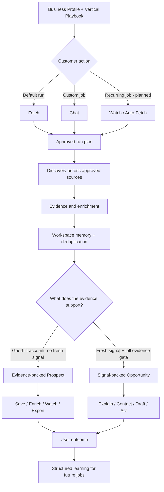
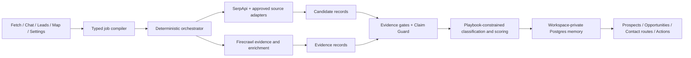

# Fetchi

## The AI market operator for service businesses

Tell Fetchi what your business sells. It finds businesses that could buy, remembers every lead it has already shown you, and is being built to watch those accounts for fresh evidence of buyer intent.

> **Tell us what your business sells — we’ll find buyers who need it this week.**

Fetchi is not a static lead database, a generic scraper, a roofing-only product, or a marketplace of cloned lead-hunting agents. It is one workspace-aware platform that becomes vertical-aware through playbooks, evidence rules, source plans, approved labels, and outreach actions.

The product combines four advantages that usually live in separate tools:

- **Prospect discovery** — build a useful buyer universe on day one.
- **Market memory** — avoid showing the same businesses repeatedly.
- **Signal intelligence** — distinguish a good-fit prospect from a business with a fresh reason to act.
- **Action routing** — help the user save, contact, watch, export, or draft the next move.

---

## What works in the current app

The current customer-facing product includes:

- **Fetch** — enter what you sell, which business buyers you want, and the market to search.
- **Lead sourcing** — return contactable businesses from the configured search runtime.
- **Website enrichment** — inspect known business websites for additional contact information.
- **Workspace lead memory** — separate new leads from businesses already saved.
- **My Leads** — maintain a workspace-private lead list with lifecycle filters.
- **Lead actions** — update status, keep notes, and move leads through Saved, Contacted, Won, Lost, or Dismissed states.
- **Exports** — download Fetch results and saved leads as CSV or JSON.

The following product surfaces are present but are not yet complete runtime claims:

- **Chat** has a customer UI shell, but its current reply path is still a placeholder. Tool-using agent jobs are product direction, not shipped behavior.
- **Map** has a routed placeholder. Territory coverage and operational map workflows are not yet available.
- **Recurring Watches / Auto-Fetch** are planned. Fetchi must not claim background monitoring until the scheduled runtime exists and has been proven.
- **Signal-backed opportunity promotion** has architecture, contracts, and proof work in the repo, but the complete customer workflow is still being sequenced.

Designs, prototypes, planning documents, and contract tests do not count as runtime proof.

---

## One engine, five customer surfaces

| Surface | Customer job | Current state |
|---|---|---|
| **Fetch** | Run the fastest default lead search using a service, buyer profile, and target market. | Working customer surface |
| **Chat** | Direct Fetchi to source, search, enrich, watch, explain, and draft through bounded jobs. | UI shell; execution runtime planned |
| **Leads** | Keep workspace-private memory of known, saved, dismissed, contacted, won, lost, and enriched businesses. | Working customer surface |
| **Map** | See searched territory, known businesses, fresh changes, and coverage gaps. | Placeholder; operational map planned |
| **Settings** | Control business context, territory, preferences, notifications, usage, and future agent behavior. | Partially implemented |

Fetch and Chat serve different user jobs, but they must reuse the same execution, evidence, dedupe, budget, and memory spine.

- **Fetch is the one-button default run.**
- **Chat is the custom command layer.**
- **Leads is the memory and pipeline.**
- **Map is the territory view.**
- **Settings is the operating context.**

---

## The product workflow



The technical opportunity loop remains:

```text
Signal -> Prospect + Enrichment -> Opportunity -> Contact Route -> Outreach Play
```

---

## Prospect versus opportunity

Fetchi keeps two kinds of value honest.

### Evidence-backed prospect

A prospect is a business that appears to fit the customer’s buyer profile and is supported by a legitimate source such as a Maps listing, directory, company website, public database, or property portfolio.

A prospect can be saved, enriched, contacted, exported, or watched. It must not inherit urgency, active buying intent, or “needs this week” language without a separate qualifying signal.

### Signal-backed opportunity

An opportunity requires a fresh public buying signal and source-linked evidence. Examples include a dated permit, opening announcement, hiring event, complaint, renovation record, procurement notice, or another playbook-approved event.

An opportunity may carry “why now” language only after the evidence, ownership, freshness, classification, and Claim Guard checks pass.

> **A good-fit business is a prospect. A good-fit business with a verified fresh reason to act may become an opportunity.**

Enrichment supports either path but does not change the lead kind by itself.

---

## Unified agent jobs

Fetchi is being designed around one deterministic job engine rather than separate cloned agent implementations.

Planned bounded job types include:

- `source_prospects`
- `search_fresh_signals`
- `enrich_saved_leads`
- `watch_saved_leads`
- `search_specific_source`
- `find_similar_leads`
- `explain_lead`
- `draft_outreach`
- `search_map_area`

A job should compile into an inspectable run plan containing:

- the goal
- target buyer and territory
- selected source plan
- filters and exclusions
- dedupe scope
- evidence requirements
- result cap and cost budget
- cadence, when recurring
- destination
- progress and failure state
- suggested next actions

The LLM may interpret the request, classify within approved values, explain evidence, rank results, and draft constrained outreach. Code owns orchestration, provider boundaries, budgets, evidence gates, labels, and Claim Guard.

### Example future Chat jobs

- Find net-new commercial cleaning buyers in Albuquerque.
- Check TDLR for projects that fit my service.
- Search local news for restaurant and medical-office openings.
- Enrich these saved leads with verified contact routes.
- Watch my top 25 prospects weekly for new permits or hiring activity.
- Find more businesses like this won customer.
- Show me what changed since my last Fetch.
- Build tomorrow’s call list.
- Draft outreach using the evidence Fetchi found.

These examples describe the product direction. They are not all available in the current Chat runtime.

---

## How Fetchi gets smarter

Fetchi should not “learn” by dumping unlimited chat transcripts into a model prompt.

The learning loop is structured and workspace-private:

1. The customer declares what they sell, who buys it, where they work, and what should be excluded.
2. Fetchi records businesses found, saved, dismissed, contacted, won, or lost.
3. Runs preserve source, query, territory, and evidence lineage.
4. Lightweight reason capture explains why a lead was dismissed, lost, or won.
5. Outcome-backed patterns influence future source allocation, ranking, and recommendations.
6. The user can inspect, correct, lock, forget, or reset learned preferences.

Instruction precedence should remain:

1. Platform laws and deterministic guards
2. Active vertical playbook and approved taxonomy
3. Explicit user instructions and locked exclusions
4. Verified workspace facts
5. Outcome-backed learned preferences
6. Behavioral inferences
7. Conversation-derived suggestions awaiting confirmation

Explicit rules always outrank inference. Freeform conversation should not silently become durable operating memory.

---

## Why Fetchi can win

### Market memory instead of repeated lists

Every Fetch should improve the workspace’s knowledge of the market: what has been found, what was dismissed, what changed, and what remains uncovered.

### Evidence instead of AI confidence theater

Search hits are candidates, not opportunities. Claims must be traceable to sources and dated evidence.

### One engine instead of an agent-template marketplace

Fetchi can offer many jobs without creating a new runtime, memory silo, or vertical app for each use case.

### Vertical-aware playbooks instead of hardcoded niche logic

The same raw event may mean different things to a roofer, cleaner, electrician, restoration company, or dumpster provider. Playbooks control the interpretation.

### Outcomes instead of static scoring

The long-term moat is not access to public data. It is understanding which sources, signals, buyers, territories, contact routes, and actions actually lead to revenue.

---

## Trust by design

1. **No opportunity without signal.**
2. **No surfaced lead without evidence.**
3. **No score without reason.**
4. **No explanation without action.**
5. **No urgency without a dated artifact.**
6. **No invented contacts, labels, buyer intent, damage, or opportunity status.**
7. **No UI-visible labels or actions outside approved playbooks and taxonomy.**
8. **Fallback states are valid product states, not broken states.**

The product also keeps these concepts separate:

```text
Status != Signal != Vertical fit != Freshness != Score != Contact confidence != Surface color
```

Coral is reserved for active urgent-action treatment. Score does not determine coral.

---

## Architecture



### Provider responsibilities

- **SerpApi = discovery.** Finds candidate signals, businesses, places, news, jobs, and source pages. It never creates an opportunity.
- **Authoritative source adapters = structured discovery.** Used where generic search does not expose fresh records reliably.
- **Firecrawl = evidence hydration and enrichment.** Reads known URLs and domains after a source exists.
- **LLMs = constrained interpretation.** Classify, rank, explain, and draft inside approved contracts and playbooks.
- **Deterministic guards = product truth.** Enforce evidence, freshness, labels, scoring reasons, contact ownership, blocked claims, budgets, and export safety.
- **Postgres / audit = memory and lineage.** Stores workspace-private state and replayable decision history.

Direct provider calls from random routes, components, or agents are not allowed.

---

## Vertical playbooks

Fetchi is one horizontal platform with vertical-aware playbooks.

Core launch verticals:

1. Commercial Roofing
2. HVAC
3. Commercial Cleaning / Janitorial
4. Plumbing
5. Landscaping / Property Maintenance
6. Electrical Contractors
7. Restoration Services
8. Pest Control
9. Painting / Tenant Improvement
10. Dumpster Rental / Junk Removal

A core-supported playbook should define:

- buyer types
- supported signals and sources
- approved signal and service-fit labels
- evidence and freshness requirements
- query templates and source plans
- scoring reasons and disqualifications
- contact routes
- outreach plays
- Suggested Actions
- examples and fallbacks
- version and active state

Commercial Cleaning / Janitorial and Commercial Roofing currently have authored v1 product specs. A playbook spec is not classifier/runtime proof until its fixtures and execution path pass.

---

## Current build status

| Area | Status |
|---|---|
| Customer app shell and authentication | Implemented |
| Fetch compose -> run -> results | Implemented |
| Website enrichment | Implemented |
| Workspace saved-lead memory and dedupe | Implemented |
| My Leads lifecycle, notes, filters, and exports | Implemented |
| Evidence/prospect/opportunity contracts and proof harnesses | Implemented as architecture/proof work |
| Live provider and source-adapter proof slices | Implemented as scoped proof work |
| Customer tool-using Chat | Not implemented; placeholder reply path |
| Saved Lead Watches / recurring Auto-Fetch | Not implemented |
| Customer Signal Watch / promotion wire | Not implemented end to end |
| Operational territory Map | Not implemented; placeholder route |
| Structured Workspace Brain and outcome learning | Product direction; not implemented end to end |
| Broad CRM integrations or auto-outreach | Intentionally not now |

For current sequencing, always verify `main`, open PRs, `docs/ROADMAP.md`, `docs/DECISIONS.md`, and post-merge proof status. Historical checkpoint numbers do not set current scope.

---

## Product memory and planning

High-value ideas should not live only in chat.

- `docs/PRODUCT_IDEA_LEDGER.md` — living product bets and candidate ideas; capture does not equal approval.
- `docs/FETCHI_PRODUCT_NOTES_CHANGELOG.md` — historical product research, decisions, and architecture capture.
- `docs/FETCHI_PRODUCT_NOTES_CHANGELOG_ADDENDUM_2026-07-10.md` — corrected Chat workbench and unified-job direction.

Ideas are promoted only after Adam approves the correct destination:

- stable product truth -> `docs/PRODUCT_CONTEXT.md`
- binding decision -> `docs/DECISIONS.md`
- sequenced work -> `docs/ROADMAP.md`
- active implementation -> one approved checkpoint

Before adding work, ask:

> **What comes off if this goes in?**

---

## Tech stack

- Next.js 14
- React 18
- TypeScript
- Tailwind CSS
- PostgreSQL + Drizzle ORM
- Clerk authentication
- SerpApi discovery
- Firecrawl evidence/enrichment where scoped
- Multiple model providers behind configuration and abstractions
- Resend notifications
- Stripe billing primitives
- Mapbox dependencies for future map workflows

The presence of a dependency does not prove the related product workflow is complete.

---

## Getting started

### 1. Configure the local environment

```bash
cp .env.example .env.local
```

Provide only the values needed for the surface you are running. Local development requires a PostgreSQL-compatible `DATABASE_URL`. Replit injects it automatically; outside Replit, provide a local or development database URL through the shell or `.env.local`.

Never commit `.env` files or real secrets.

### 2. Install dependencies

```bash
npm ci
```

### 3. Prepare the local development database

```bash
npm run db:push
npm run db:seed
npm run db:verify
```

`npm run db:push` is a local/development schema-sync path. It is not a production migration strategy.

### 4. Run the app

```bash
npm run dev
```

The development server uses port `5000` and binds to `0.0.0.0`.

---

## Validation

Every checkpoint defines its own scoped proof. Default validation expectations are:

```bash
git status -sb
git branch --show-current
git rev-parse --short HEAD
git log --oneline main..HEAD
git diff --name-status main..HEAD
git diff --stat main..HEAD
npm run type-check
rm -rf .next && npm run build
```

Also report:

- route count
- changed files
- protected-file scope: yes/no
- package scope: yes/no
- provider/search scope: yes/no
- DB/schema scope: yes/no
- auth/billing/admin/settings scope: yes/no
- app/routes/UI scope: yes/no
- runtime/export/CRM/outreach scope: yes/no

UI checkpoints also require relevant routes, screenshots, responsive states, fallback states, and design-source compliance.

If an environment, credential, DNS, dependency, or connector issue blocks proof, report the exact blocker and do not claim completion.

---

## Source of truth

Read these before changing the relevant area:

- `AGENTS.md` — coding-agent rules, product laws, boundaries, protected files, and validation discipline
- `docs/PM_OPERATING_SYSTEM.md` — authority hierarchy and checkpoint workflow
- `docs/PRODUCT_CONTEXT.md` — product model, laws, verticals, and lead-supply lanes
- `docs/ROADMAP.md` — planning sequence; verify freshness against GitHub before acting
- `docs/DECISIONS.md` — accepted product decisions
- `docs/CLEANUP_PLAN.md` — repo cleanup policy
- `docs/infra/github-publishing-path.md` — official publishing workflow
- `docs/AGENT_WEB_DATA_ARCHITECTURE.md` — signal, prospect, evidence, opportunity, and lineage architecture
- `docs/PROVIDER_CONTRACTS.md` — provider and evidence boundaries
- `docs/product/lead-funnel-product-spec.md` — Lead Funnel model
- `docs/product/vertical-playbook-registry.md` — vertical playbook structure
- `docs/product/playbooks/` — approved vertical specs
- `docs/design/lead-card-taxonomy.md` — labels, fallbacks, lifecycle, and surface grammar
- `docs/DESIGN_SOURCE_OF_TRUTH.md` — current design authority
- `docs/PRODUCT_IDEA_LEDGER.md` — non-authoritative idea-management surface

---

## Protected scope

Do not modify these files unless the active checkpoint explicitly approves them:

```text
replit.md
FETCHI_CLAUDE_CODE_BRIEF.md
db/schema.ts
db/index.ts
db/seed.ts
drizzle.config.ts
```

Also do not touch auth, billing, Stripe, DB schema or migrations, provider/search/agent runtime, admin, Settings, middleware, routes, or package files unless the checkpoint explicitly scopes them.

---

## Repository workflow

1. Start from clean, synced `main`.
2. Verify current main HEAD, branch, open PRs, roadmap checkpoint, changed files, divergence, and prior checkpoint cleanup.
3. Define one narrow checkpoint with allowed files, protected files, acceptance criteria, proof, and non-goals.
4. Implement and prove locally.
5. Publish a draft PR only after Adam approves publishing.
6. Review the actual GitHub PR diff.
7. Merge only after Adam approves.
8. Run post-merge proof on `main`.
9. Verify checkpoint-branch cleanup.
10. Start the next checkpoint only after the prior one is fully closed.

Never overlap checkpoints. Stop on divergence, protected-file drift, credential setup, destructive cleanup, force operations, publish-time rewrites, or unclear scope.

---

## Product boundary

Fetchi is building a powerful operator, not an unbounded autonomous agent.

**Build:** sourcing, memory, evidence, signal watch, enrichment, actions, learning, territory intelligence.

**Do not drift into:** a public agent marketplace, cloned vertical apps, a full CRM, broad crawling by default, unsupported social scraping, manufactured urgency, cross-customer lead sharing, or automatic outreach without explicit user control.
